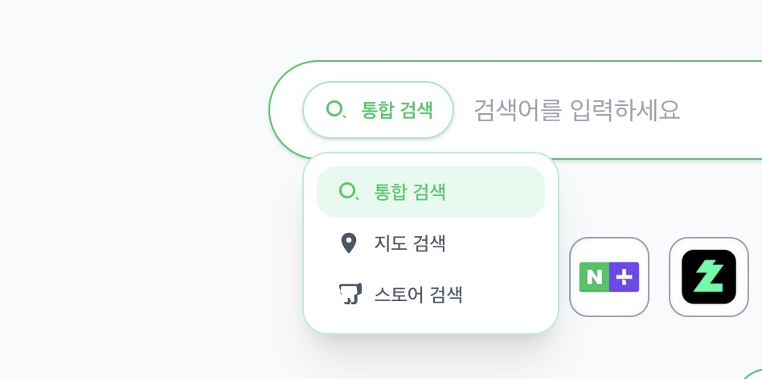
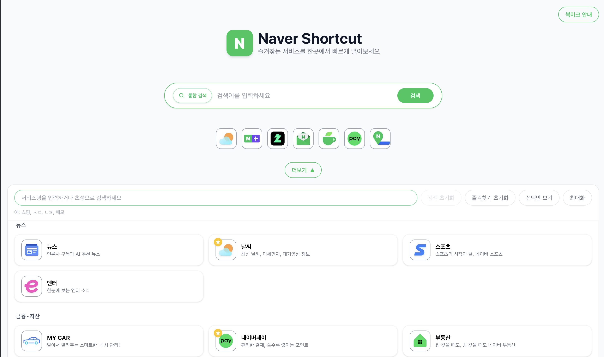
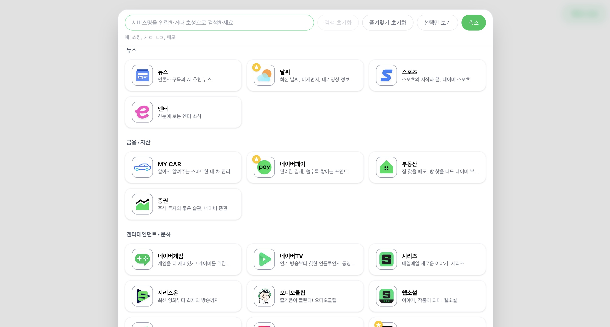
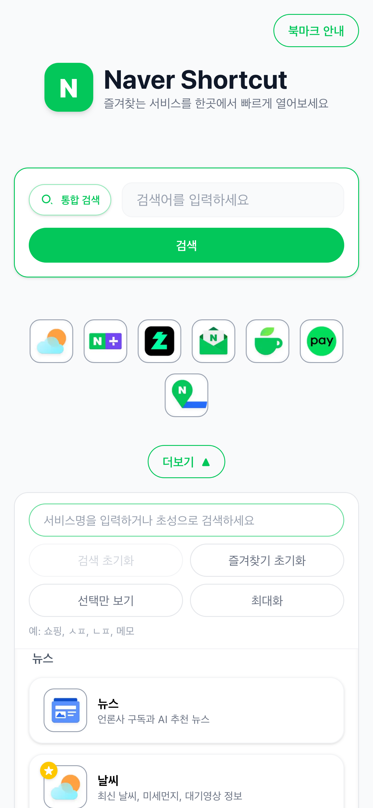
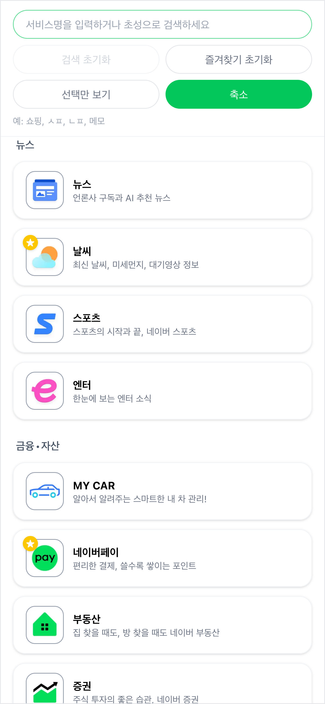

# Naver Shortcut

네이버 컨텐츠를 커스텀한 바로가기 페이지

## 기능

- 네이버 통합, 지도, 쇼핑 검색 지원
- 네이버 컨텐츠 바로가기 추가

## 스크린샷

### Desktop






### Mobile

<p>
  
  
  
</p>

## 기술 스택

- NextJs
- TypeScript
- TailwindCSS

## 빌드

### npm build

```bash
npm run build
```

### example docker build

```bash
docker build -t naver/shortcut:1.0.0 -f docker/Dockerfile .
```

## 배포

### 환경변수

#### 검색 히스토리 최대보관 개수

- NEXT_PUBLIC_SEARCH_HISTORY_LIMIT=20

#### 이미지 품질

- NEXT_PUBLIC_IMAGE_QUALITY=30 ## 30, 40, 50, 60, 70, 80, 90, 100

#### 날씨정보 API

1. www.openweathermap.org 회원가입
2. login 후 my api keys 접속
3. generate API Key 생성 후 복사
4. NEXT_PUBLIC_OPEN_WEATHER_MAP_API_KEY 환경변수에 추가

### npm run

```bash
npm run start
```

### example docker run

```bash
docker run -d -p 3000:3000 naver/shortcut:1.0.0
```
